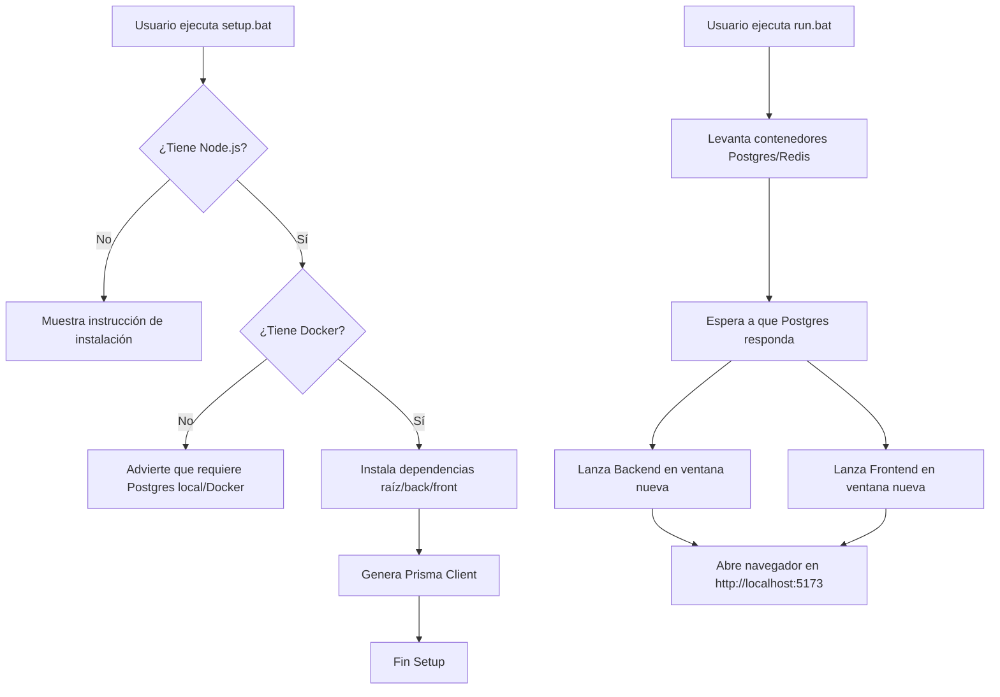

# Plan de Implementación — Reestructuración, Optimización y Empaquetado Universal

Este plan detalla la reestructuración completa del monorepo **Farmacy** para limpiar contenido basura y archivos vacíos, y consolidar el stack real en la **Semana 14 de desarrollo**. Se introduce una solución universal de dos ejecutables (`setup.bat` y `run.bat`) para facilitar el despliegue local de la aplicación y se comprime el cronograma técnico para las últimas **2 semanas de desarrollo (Semanas 15–16)**.

---

## Contexto y Estado del Proyecto (Semana 14)

El proyecto se encuentra en un estado de **alta madurez técnica (Semana 14)**:
1. **Frontend:** El portal B2C (Tienda pública, catálogo, carrito drawer, checkout) y el panel POS de administración de caja (con lector de barras e interactividad) están al 100% de desarrollo, construidos sobre React + Vite + TypeScript.
2. **Backend:** Funciona robustamente sobre Node.js + Express + Prisma + PostgreSQL + Redis. Toda la lógica de negocio y consultas a base de datos están consolidadas directamente dentro de los archivos de rutas (`*.routes.ts`).
3. **Chatbot:** Se ha descartado el uso de modelos LLM (Python) para evitar alucinaciones, asegurar precisión médica absoluta, y erradicar latencias. Se implementa un **Chatbot SQL/FAQ determinista** en TypeScript que consulta directamente las respuestas predefinidas en base de datos y permite la escalación a humanos en horario laboral.
4. **Dispersión:** Se crearon decenas de archivos vacíos de controladores (`*.controller.ts`), servicios (`*.service.ts`), esquemas (`*.schema.ts`), componentes de UI, y componentes administrativos que no se utilizan y generan ruido en el espacio de trabajo.

---

## Cambios Propuestos

### 1. Reestructuración de Archivos (Eliminación de Contenido Basura)

Eliminaremos más de **80 archivos de 0-bytes (vacíos)** y carpetas no utilizadas en backend y frontend para organizar el monorepo y reducir su peso/ruido, sin perder ninguna funcionalidad.

> [!WARNING]
> **Sin pérdida de funcionalidad:** Todos los controladores y servicios eliminados están vacíos. La lógica de negocio está consolidada al 100% en los archivos `*.routes.ts`. En el frontend, la estilización se aplicó directamente con Tailwind CSS en línea, haciendo redundantes los componentes vacíos en `components/ui` y `components/admin`.

#### [DELETE] Módulos redundantes en Backend
Dado que `backend/src/modules/inventario/inventario.routes.ts` centraliza toda la lógica administrativa (Lotes, Proveedores, Compras, Clientes Admin, Empleados, Sucursales y Reportes), eliminaremos estas carpetas duplicadas y vacías:
*   [inventario/inventario.routes.ts](file:///c:/Users/andyh/Desktop/Soft/Lab_sof/Antigravity_Farmacy/backend/src/modules/inventario/inventario.routes.ts) *(SE CONSERVA - Lógica centralizada)*
*   [DELETE] `backend/src/modules/clientes/*`
*   [DELETE] `backend/src/modules/compras/*`
*   [DELETE] `backend/src/modules/empleado/*`
*   [DELETE] `backend/src/modules/empleados/*`
*   [DELETE] `backend/src/modules/lotes/*`
*   [DELETE] `backend/src/modules/proveedores/*`
*   [DELETE] `backend/src/modules/reportes/*`
*   [DELETE] `backend/src/modules/sucursales/*`

#### [DELETE] Archivos vacíos (`0 B`) en Backend
*   Archivos de configuración vacíos: `backend/src/config/{cloudinary.ts, cors.ts, wompi.ts}`
*   Middlewares vacíos (ya consolidados en `index.ts`): `backend/src/middlewares/{autenticar.ts, autorizarRol.ts, limitarPeticiones.ts, manejarErrores.ts, registrarLog.ts, subirImagen.ts, validarCuerpo.ts, autenticarCliente.ts, autenticarClientes.ts}`
*   Jobs vacíos: `backend/src/jobs/{alertasVencimiento.job.ts, backupBD.job.ts, expirarPuntos.job.ts}`
*   Utils vacíos: `backend/src/utils/{bcrypt.utils.ts, email.templates.ts, paginacion.utils.ts}`
*   Archivos `*.controller.ts`, `*.service.ts`, `*.schema.ts` vacíos dentro de los módulos activos:
    *   `auth`, `auth-cliente`, `caja`, `categorias`, `chatbot`, `imagenes`, `inventario`, `pagos`, `productos`, `ventas`

#### [DELETE] Archivos vacíos (`0 B`) en Frontend
*   Componentes UI vacíos: `frontend/src/components/ui/*.tsx` (12 archivos)
*   Componentes admin vacíos: `frontend/src/components/admin/*.tsx` (27 archivos)
*   Componentes compartidos vacíos: `frontend/src/components/shared/*` (excepto `PageShell.tsx`)
*   Componentes de tienda vacíos: `frontend/src/components/tienda/*` (excepto `CarritoDrawer.tsx`, `ChatbotWidget.tsx`, `Footer.tsx`, `Header.tsx` y `ProductCard.tsx`)

---

### 2. Automatización con Dos Ejecutables Universales

Para facilitar la distribución del proyecto, implementaremos dos scripts `.bat` portables en la raíz:

#### [NEW] [setup.bat](file:///c:/Users/andyh/Desktop/Soft/Lab_sof/Antigravity_Farmacy/setup.bat)
*   Verifica la instalación de `node` y `npm`.
*   Verifica `docker` y advierte si no está disponible (para que el usuario use Postgres de forma local o active Docker Desktop).
*   Instala automáticamente todas las dependencias mediante `npm install` en la raíz, `/backend` y `/frontend`.
*   Genera el cliente Prisma (`npm run db:generate` en backend).
*   Aplica el esquema actual en base de datos (`npm run db:push` en backend).
*   Puebla la base de datos con los datos semilla (`npm run db:seed` en backend).

#### [NEW] [run.bat](file:///c:/Users/andyh/Desktop/Soft/Lab_sof/Antigravity_Farmacy/run.bat)
*   Inicia los contenedores de desarrollo con `docker compose -f docker-compose.dev.yml up -d`.
*   Espera a que PostgreSQL esté listo y respondiendo consultas (`pg_isready` en el contenedor).
*   Abre una nueva terminal para iniciar el backend (`npm run dev`).
*   Abre otra terminal para iniciar el frontend (`npm run dev`).
*   Abre automáticamente el navegador predeterminado en `http://localhost:5173`.

#### [DELETE] [start-all.bat](file:///c:/Users/andyh/Desktop/Soft/Lab_sof/Antigravity_Farmacy/start-all.bat)
*   Reemplazado por los nuevos scripts universales simplificados sin dependencias estrictas de scripts de PowerShell de terceros.

---

## Cronograma de Entregables Comprimido (Semanas 15-16)

Comprimimos los entregables restantes del proyecto (que corresponden a pantallas administrativas de stubs y tareas programadas) en las últimas **dos semanas**:

### Semana 15: Devoluciones, Fidelización y CRM Completo
1. **Devoluciones INVIMA:** Implementación final de `Devoluciones.tsx` en el panel de caja, con transacciones en base de datos PostgreSQL para reincorporar stock por lote bajo normativas.
2. **Programa de Fidelidad:** Implementación de `ProgramaFidelidad.tsx` y el CRM de clientes (`ListaClientes.tsx` y `DetalleCliente.tsx`) para gestionar puntos acumulados de clientes.
3. **Módulo de Suministros:** Implementación final de `ListaProveedores.tsx`, `DetalleProveedor.tsx`, `OrdenesCompra.tsx`, `NuevaOrden.tsx` y la recepción física de mercancía FEFO (`RecepcionMercancia.tsx`) para inventario.

### Semana 16: Reportes con Recharts, Configuración y Cierre del Proyecto
1. **Inteligencia de Negocio:** Construcción premium de gráficos con la librería **Recharts** en `ReporteVentas.tsx` (ventas diarias y métodos de pago), `ReporteInventario.tsx` (alertas de vencimiento y rotación de stock), `ReporteCompras.tsx` e histogramas en `ReporteClientes.tsx`.
2. **Configuración Multi-sede:** Creación del panel de control general (`ConfigGeneral.tsx`), gestión de sedes y horarios (`ConfigSucursales.tsx`), seguridad y control de accesos (`ConfigSeguridad.tsx` e interactividad con los logs de auditoría en la tabla `LogActividad`).
3. **Backups e Historial de Movimientos:** Activación del cron job programado de copias de seguridad de PostgreSQL y el visor de movimientos históricos (`Movimientos.tsx`).
4. **Cierre de Proyecto:** Pruebas E2E completas y validación en local mediante los ejecutables universales.

---

## Plan de Verificación

1. **Integridad del Código:**
   *   Validar que, tras eliminar los archivos vacíos de backend y frontend, no existan errores de importación y que el backend y frontend compilen correctamente (`npm run build` en backend, `npm run build` en frontend).
2. **Verificación de Ejecutables:**
   *   Probar `setup.bat` simulando una primera instalación de dependencias y validando que las tablas y seeds en PostgreSQL se creen exitosamente.
   *   Probar `run.bat` y confirmar que inicie Docker compose, espere la base de datos, inicie ambos servidores en segundo plano y abra el navegador en `http://localhost:5173`.
3. **Funcionamiento del Chatbot:**
   *   Enviar mensajes de consulta de medicamentos y verificar la respuesta instantánea conectando con PostgreSQL sin dependencias de Python ni latencia.
